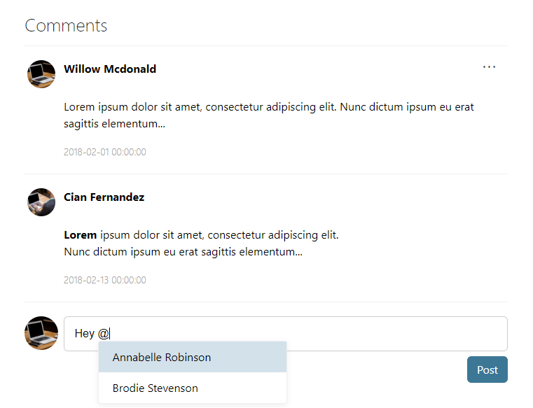

# Apollo Comments
[](https://badge.fury.io/js/%40afconsult%2Fapollo-comments)
[](https://opensource.org/licenses/MIT)
<br />
React Comments Plugin for [Apollo](https://github.com/afconsult/apollo)



## Getting Started
### Install
Install with npm:
```bash
npm install @afconsult/apollo-comments --save
```
Install with [Yarn](https://yarnpkg.com/en/):
```bash
yarn add @afconsult/apollo-comments
```

### Example
1. import the stylesheet:
```javscript
import '@afconsult/apollo/dist/css/apollo-comments.css';
```

2. Import the component:
```javascript
import CommentBox from '@afconsult/apollo-comments';
```

3. Use the component
```javascript
class MyComponent extends React.Component {
  constructor(props) {
    super(props);

    this.author = {
      id: '77bfcd2a-b243-435d-8666-784ab4fa87fd',
      displayName: 'Willow Mcdonald',
      imageUrl: 'https://picsum.photos/200/200/?image=0',
      onClick: (authorId) => { console.log(authorId); },
    };

    this.comments = [
      {
        id: shortid.generate(),
        author: {
          displayName: 'Willow Mcdonald',
          id: '77bfcd2a-b243-435d-8666-784ab4fa87fd',
          imageUrl: 'https://picsum.photos/200/200/?image=0',
          onClick: (authorId) => { console.log(authorId) }
        },
        createdDate: new Date(2018, 1, 1).toJSON(),
        text: 'Lorem ipsum dolor sit amet, consectetur adipiscing elit. Nunc dictum ipsum eu erat sagittis elementum...',
        actions: [{ label: 'Delete', onClick: (commentId) => console.log(`Deleted ${commentId}`) }],
      },
      {
        id: shortid.generate(),
        author: {
          displayName: 'Cian Fernandez',
          id: '0ea33d62-db04-4923-8bea-170bd99cb65f',
          imageUrl: 'https://picsum.photos/200/200/?image=1',
          onClick: (authorId) => { console.log(authorId) }
        },
        createdDate: new Date(2018, 1, 13).toJSON(),
        text: '<b>Lorem</b> ipsum dolor sit amet, consectetur adipiscing elit. \nNunc dictum ipsum eu erat sagittis elementum...',
      },
    ];

    this.mention = {
      allowedChars: /^[A-Za-z\sÅÄÖåäö]*$/,
      denotationChars: ['@'],
      onSource: (searchTerm, renderList, denotationChar) => {
        const items = [
          { id: 'ee2aec62-5a1b-46b3-a093-c6ce2ef244dd', value: 'Annabelle Robinson' },
          { id: 'c4f3548c-0090-4bae-8536-cc320d8035bf', value: 'Brodie Stevenson' }
        ];

        if (searchTerm.length === 0) {
          renderList(items, searchTerm);
        } else {
          const matches = [];
          for (i = 0; i < items.length; i++) {
            if (~items[i].value.toLowerCase().indexOf(searchTerm.toLowerCase())) {
              matches.push(items[i]);
            }
          }
          renderList(matches, searchTerm);
        }
      }
    };
  }

  render() {    
    return (
      <CommentBox
        author={this.author}
        comments={this.comments.sort((a, b) => a.createdDate < b.createdDate ? -1 : 1)}
        mention={this.mention}
        onSubmit={editor => { }}
        placeholder="Write a comment..."
        title="Comments"
      />
    );
  }
}
```

### Props
`author`
: (**_required_**) An object describing the user of the comment box. The object should specify an `id`, `displayName`, `imageUrl` and `onClick(authorId)`.

`comments`
: An array of objects specifying comment data. Default is `[]`.

| Comment    | Default        | Description  |
| ---------- | -------------- | ------------ |
| `id` | `null` | A unique string ID used to identify the comment. |
| `author` | `{}` | An object describing the author of the comment. The object should specify an `id`, `displayName`, `imageUrl` and `onClick(authorId)`. |
| `createdDate` | `null` | A string representation of a date for when the comment was created. |
| `text` | `null` | Text for the comment. Can be a string containing HTML. |
| `actions` | `[]` | An array of objects specifying custom actions that can be applied to edit the comment. Each action requires a `label` and `onClick(commentId)`. |

`dateFormat`
: A [Moment.js](https://momentjs.com/docs/#/displaying/format/) string token. Default is `YYYY-MM-DD HH:mm:ss`

`mention`
: (**_optional_**) An object specifying necessary options module [Quill Mention](https://github.com/afconsult/quill-mention) module. Default is `null`.

| Options    | Default        | Description |
| ---------- | -------------- | ------------ |
| `allowedChars` | `[a-zA-Z0-9_]` | Allowed characters in search term triggering a search request using regular expressions. |
| `denotationChars` | `['@']` | Specifies which characters will cause the quill mention autocomplete to open. |
| `onRenderItem(item, searchTerm)` | `null` | A function that gives you control over how matches from source are displayed. You can use this function to highlight the search term or change the design with custom HTML. |
| `onSource(searchTerm, renderList, denotationChar)` | `null` |  Required callback function to handle the search term and connect it to a data source for matches. The data source can be a local source or an AJAX request. The callback should call `renderList(matches, searchTerm);` with matches of JSON Objects in an array to show the result for the user. The JSON Objects should have `id` and `value` but can also have other values to be used in `renderItem` for custom display. |

`onSubmit(editor)`
: (**_required_**) Called back with the [React Quill](https://github.com/zenoamaro/react-quill/blob/master/README.md) editor after submit.

`onTranslate(commentId)`
: Called back with the comment id that has been requested to translate. Will display a button next to each comment's date if assigned. Default as `null`.

`placeholder`
: Specifying a short hint that describes the expected value of the input field. Default is `null`.

`title`
: A string representing the title of the comment box. Default is `null`.

## Contribute
Feel free to [create an issue or feature request](https://github.com/afconsult/apollo-comments/issues/new).

## Authors
**Jon Wahlström** ([jonwa](https://github.com/jonwa))

See also the list of [contributors](https://github.com/afconsult/apollo-comments/contributors).

## License
This project is licensed under the MIT License - see the [LICENSE](LICENSE) file for details.
